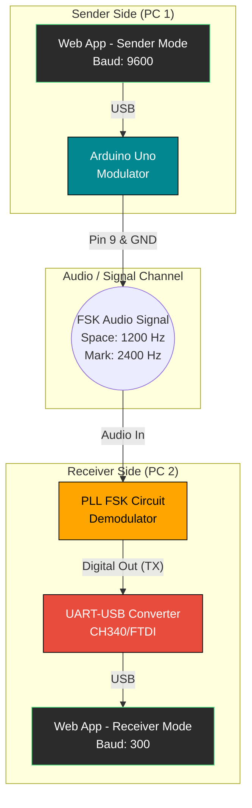

# FSK Communicator Web Tool

This repository contains a unified Web Serial application for FSK (Frequency Shift Keying) transmission and reception, replacing the older Python desktop tools. 

The web app uses the **Web Serial API** and runs directly from Google Chrome, Edge, or Opera. It features a retro, videogame-inspired interface.

## 🚀 Live Demo
You can host this `docs/` folder on GitHub Pages to access it from anywhere!
*(Once GitHub pages is enabled for the `docs/` directory or root, insert the link here).*

> **Note:** Safari, Firefox, and mobile browsers do not support the Web Serial API.

---

## 🔌 Hardware Connection Guide

To successfully transmit text via audio using FSK, you need to connect the hardware precisely as shown below.

### Block Diagram

### Wiring Steps

1. **PC1 (Sender) Setup:**
   - Connect the **Arduino Uno** to PC1 via USB.
   - Upload the `TC2-PLL-FSK/TC2-PLL-FSK.ino` sketch to the Arduino.
   - Open the web app on PC1, select **[ SENDER ]**, and click **CONNECT PORT**. Select the Arduino's COM port.
   - *Note: The Sender connects at 9600 baud automatically.*

2. **Audio Link:**
   - Connect Arduino **Pin 9** (Audio Out) to the input of your **PLL FSK Demodulator Circuit**.
   - Connect the Arduino's **GND** to the PLL Circuit's **GND**.

3. **PC2 (Receiver) Setup:**
   - Connect the output of the **PLL FSK Demodulator** to the `RX` pin of a **UART-USB converter**.
   - Ensure the PLL Circuit and the UART-USB converter share a common **GND**.
   - Plug the UART-USB converter into PC2.
   - Open the web app on PC2, select **[ RECEIVER ]**, and click **CONNECT PORT**. Select the UART-USB's COM port.
   - *Note: The Receiver connects at 300 baud automatically (the true data rate of the FSK transmission).*

### Testing
Type a message on the Sender app and hit `Send`. The Arduino will modulate the text into audio tones (1200 Hz / 2400 Hz) at 300 baud. The PLL circuit will demodulate these tones back into digital 1s and 0s, passing them through the UART converter to PC2, where the Receiver app will display the decoded text.

---

**Authors:** Nicolás Beade & Javier Petrucci
**Course:** Laboratorio de Electrónica II (25.16)
